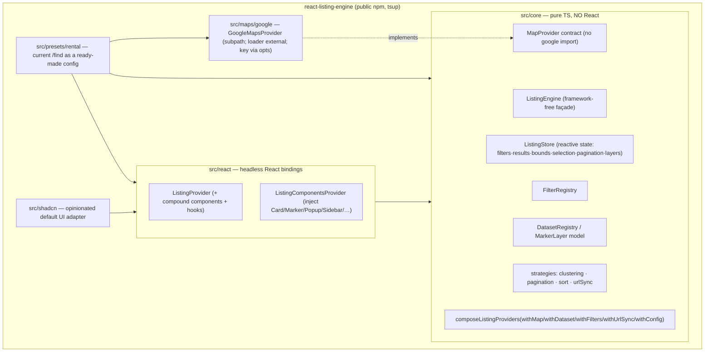
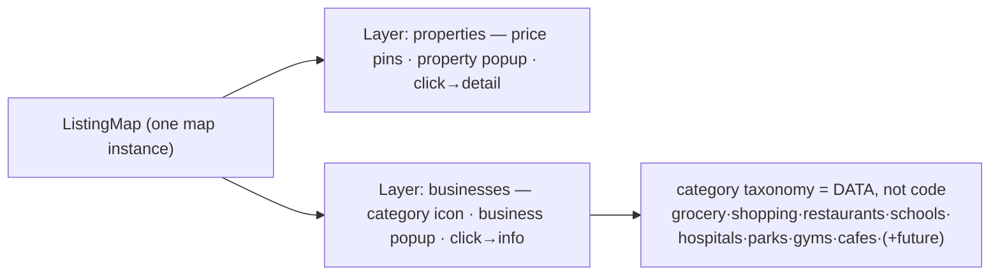

# react-listing-engine — Phase 1 Architecture Review & Design

**Date:** 2026-07-24
**Status:** Draft for approval (Phase 1). No implementation until approved.
**Author:** design session

---

## 0. Decisions locked in this session

| # | Decision | Rationale |
|---|---|---|
| D1 | **A standalone published React library**, modeled 1:1 on `react-wizard-engine` (own repo, tsup ESM+CJS, `changeset publish` to public npm, `examples/` demo). | User: "create a lib and use in my project **like react-wizard**." |
| D2 | **Headless `core/` (pure TS, no React) + `react/` bindings + optional `/shadcn` styled adapter.** | Matches react-wizard-engine; satisfies "framework-agnostic where practical." |
| D3 | **Google Maps only**, behind a `MapProvider` seam. Key supplied via provider options, never hardcoded. **Mapbox dropped.** | User: "Google maps not mapbox." Brief #4: provider configurable externally. |
| D4 | **Generic engine**; all rental specifics move to `src/presets/rental`. Businesses/schools/etc. are additional presets/datasets. | Brief #1, #6, #8. |
| D5 | **First consumer = the `examples/` demo app.** Real product integration (Angular `/find`, or a React app) is a **separate follow-up task**, not this cycle. | User chose "Standalone-first (like react-wizard)." |
| D6 | The current Preact `@libs/listing` widget is **superseded**, not evolved in place. Its good ideas are ported; its Mapbox+rental coupling is not. | See §2–§3. |

**Open (non-blocking) decisions** deferred to release time: public vs private npm scope; final package name (`react-listing-engine` assumed); whether a future `angular/` binding is built to let the Angular `/find` consume `core/` natively (designed-for, not built now).

---

## 1. What the existing implementation is

Two distinct artifacts, often conflated:

1. **`@libs/listing`** — a **Preact + Mapbox GL + Webpack** UMD micro-app. Mounted imperatively: `listingModule('elementId', config)` renders a Preact tree into a host DOM node. Published as `@libs/listing` with semantic-release.
2. **`_apps/website/.../landlord/pages/listing`** — the **Angular** consumer. `listing-list.component.ts` does a browser-only dynamic `import('@libs/listing')` and hands it a config (Mapbox token + data callbacks wired to `LocaListingApi`), inside `ViewEncapsulation.None` + `ngSkipHydration`. `listing-view` is a fully native Angular detail page and does **not** use the widget.

The library's design is **config-object inversion-of-control**: consumers pass `map.getPoints`, `listing.get`, `favorite.get/onToggle`, `preferences.onUpdate` callbacks. Data *source* is injectable; data *shape*, filters, components, and map provider are not.

### 1.1 Feature inventory (what already works)

Clustering (`use-clusters`), favorites (`use-favorite`), pagination (`use-pagination`), URL-state sync (`use-query-params`), responsive/mobile toggle (`use-media-query`, `mobile-header`), geocoder search (`use-geocoder`), price/beds-baths/square/year/rental-type filters, list sorting, map popups, theming via `themeColor` + global CSS.

---

## 2. Coupling analysis — the walls

```
                       ┌──────────────── THREE HARD WALLS ─────────────────┐
 Angular host ──cfg──▶ │  Preact tree (welded to Preact runtime)            │
 (listing-list)        │   ├─ Mapbox GL (use-bounds/markers/clusters/       │
                       │   │            zoom/geocoder + map.component.tsx)   │ ← B: map provider
                       │   ├─ Listing / MapPoint / ListingFilters            │ ← A: rental domain
                       │   │  (rental DTOs threaded through every layer)     │
                       │   └─ fixed filter set + fixed components            │ ← C: config, not composition
                       └────────────────────────────────────────────────────┘
```

| Wall | Evidence | Blocks brief requirement |
|---|---|---|
| **A · Rental domain baked in** | `Listing` (90-field rental DTO), `MapPoint.properties = {listingId, price, propertyId, currencyCode}`, `ListingFilters` (beds/baths/sqft/pets/lease) are concrete types in every signature | #1 generic engine, #6 businesses |
| **B · Mapbox hardcoded** | `use-bounds/-markers/-clusters/-zoom/-geocoder` + `map.component.tsx` import `mapbox-gl`; `map.accessToken` is a required config field | #4 Google Maps |
| **C · Config, not composition** | `ListingModuleConfig` exposes only data callbacks + `filters.default/exclude/price.symbol`. Filter set and components are fixed; no add/remove/reorder/replace/inject | #2 filters, #3 components, #5 marker types |
| D · Single point source | one `map.getPoints` returns one `MapPoint[]` | #5 multi-marker, #6 businesses |
| E · Host coupling via globals | DOM `CustomEvent`s + global CSS + `ViewEncapsulation.None` | clean multi-app reuse |

**Root cause:** the library inverts *data* but hardcodes *shape, presentation, and map*. The redesign inverts all four.

---

## 3. Keep / redesign

**Keep (the ideas are sound — port them):**
- Inversion-of-control data callbacks → become typed **adapter interfaces**.
- Feature set already earned: clustering, favorites, pagination, URL sync, mobile toggle, geocoder.
- Hook decomposition as concepts → become engine services + React hooks.
- Filter decomposition (price/beds-baths/…) → seeds of the **rental preset's** filter registry.

**Redesign:**

| From | To |
|---|---|
| Preact runtime | **React 18/19** headless bindings (like react-wizard-engine) |
| `Listing`/`MapPoint`/`ListingFilters` concrete types | Generic `TEntity` / `TFilters` + `EntityAdapter<TEntity, TFilters>` |
| Mapbox hooks | `MapProvider` contract + `GoogleMapsProvider` (subpath entry) |
| `ListingModuleConfig.filters` object | `FilterRegistry` (add / remove / reorder / replace / inject) |
| Fixed Preact components | React compound components + `ListingComponentsProvider` (component injection) |
| Single `getPoints` | `DatasetRegistry` → N **marker layers** (properties, businesses, …) |
| DOM CustomEvents + global CSS | Typed engine events (`engine.on(...)`) + scoped styles + CSS-var theming |
| Config-only tuning | **Strategy composition** `composeListingProviders(withX(...))` |

---

## 4. Target architecture (react-wizard-engine blueprint applied)

### 4.1 Package & exports

```jsonc
// package.json (mirrors react-wizard-engine)
{
  "name": "react-listing-engine",
  "type": "module",
  "sideEffects": false,
  "exports": {
    ".":            "./dist/index.js",         // headless core + React adapter
    "./shadcn":     "./dist/shadcn/index.js",  // opinionated default UI
    "./maps/google":"./dist/maps/google/index.js", // GoogleMapsProvider (loader kept out of core)
    "./presets/rental": "./dist/presets/rental/index.js" // today's /find as a preset
  },
  "peerDependencies": {
    "react": ">=18",
    "@googlemaps/js-api-loader": ">=1",   // optional, only for maps/google
    "@radix-ui/react-slot": ">=1"
  }
}
```

Build: **tsup**, multi-entry (`index`, `shadcn/index`, `maps/google/index`, `presets/rental/index`), `format: ['esm','cjs']`, `dts: { resolve: true }`, `'use client'` banner preserved, `react`/`react-dom`/`@googlemaps/js-api-loader`/radix marked `external`. Vitest + `@testing-library/react`. Release via changesets.

### 4.2 Source layout (parallel to the wizard, column-for-column)

```
react-wizard-engine            →  react-listing-engine
  src/core/    (pure TS)        →  src/core/    (pure TS — ListingEngine, ListingStore,
                                                 adapters, filters, datasets, map contract,
                                                 strategies, events, compose-listing-providers)
  src/react/   (headless React) →  src/react/   (ListingProvider, compound components, hooks,
                                                 ListingComponentsProvider)
  src/shadcn/  (styled adapter) →  src/shadcn/  (default Card/Marker/Popup/Filters/Layout)
  —                             →  src/maps/google/   (GoogleMapsProvider — separate entry)
  —                             →  src/presets/rental/ (rental filters+enums+card+adapter glue)
  src/interfaces, src/enums     →  src/interfaces, src/enums (generic; rental enums live in preset)
  src/__tests__                 →  src/__tests__ (contract tests, hooks, fakes)
  examples/basic                →  examples/basic (Vite demo — the first consumer)
```

### 4.3 Layering



Dependencies point **downward only**. `core/` is importable in any TS runtime (this is the seam a future `angular/` binding would consume — the "framework-agnostic where practical" resolution to the Angular/React tension).

---

## 5. Public API (faithful to wizard idioms)

### 5.1 Core contracts (`src/core`, `src/interfaces`)

```ts
// Generic entity data source — replaces the fixed map.getPoints / listing.get callbacks
export interface EntityAdapter<TEntity, TFilters> {
  list(filters: TFilters, page: PageRequest): Promise<Page<TEntity>>;
  getPoints(filters: TFilters, bounds: Bounds): Promise<MapPoint<TEntity>[]>;
  getById?(id: EntityId): Promise<TEntity>;
  toFilters?(query: QueryParams): TFilters;   // URL sync (optional)
  toQuery?(filters: TFilters): QueryParams;
}

// Filters as data → add / remove / reorder / replace / inject
export interface FilterDefinition<TFilters, TValue = unknown> {
  key: string;
  order: number;
  render: FilterRenderKey | ComponentType<FilterControlProps<TValue>>; // named default OR custom component
  toParams(value: TValue): Partial<TFilters>;
  fromParams(filters: TFilters): TValue;
  isActive?(filters: TFilters): boolean;      // powers active-filter chips
}

// Datasets → multiple marker layers on one map (properties + businesses + …)
export interface DatasetDefinition<TEntity, TFilters> {
  id: string;                                 // 'properties' | 'businesses' | ...
  adapter: EntityAdapter<TEntity, TFilters>;
  marker: MarkerRenderer<TEntity>;            // icon + popup + click action
  clustering?: ClusterOptions | false;        // per-layer, future-friendly
  visible?: () => boolean;
}

// Map provider — Google first; contract lives in core, google impl is a subpath
export interface MapProvider {
  mount(el: HTMLElement, opts: MapInitOptions): MapHandle; // opts.apiKey — never hardcoded
  renderLayer(handle: MapHandle, layer: RenderedLayer): Unsubscribe;
  onBoundsChange(handle: MapHandle, cb: (b: Bounds) => void): Unsubscribe;
  fitBounds(handle: MapHandle, b: Bounds): void;
  destroy(handle: MapHandle): void;
}

// Framework-free façade (parallels WizardEngine): subscribe()/on()/imperative methods
export class ListingEngine<TEntity, TFilters> { /* store, registries, strategies */ }
```

### 5.2 Strategy composition (parallels `composeWizardProviders`)

```ts
export const listingProps = composeListingProviders<PropertyEntity, RentalFilters>(
  withMap(googleProvider),                    // withMap → props.map
  withDataset(propertiesDataset),             // withDataset → props.datasets.push(...)
  withDataset(nearbyBusinessesDataset),
  withFilters(reg => reg.add(petFilter).replace('price', MyPriceFilter).reorder([...])),
  withUrlSync({ mode: 'query' }),             // withUrlSync → props.strategies.urlSync
  withConfig({ pagination: 'infinite', enableTracing: 'none' }),
);
// each withX is a (props) => void mutator, exactly like the wizard
```

### 5.3 React surface (parallels `<WizardProvider>` + compound components)

```tsx
<ListingProvider {...listingProps}>
  <ListingComponentsProvider Card={PropertyCard} Marker={PricePin} Popup={PropertyPopup}
                             Empty={NoResults} Loading={ResultsSkeleton} Toolbar={MyToolbar}>
    <ListingToolbar />
    <ListingFilters />
    <Split>
      <ListingList />
      <ListingMap />
    </Split>
    <ListingPagination />
  </ListingComponentsProvider>
</ListingProvider>
```

- `ListingProvider` constructs `new ListingEngine(...)` in an effect and disposes on unmount (same Strict-Mode-safe pattern as `WizardProvider`).
- Hooks: `useListing()`, `useListingResults()`, `useListingMap()`, `useListingFilters()`, `useListingLayer(id)`, `useListingEvent(type, cb)`.
- `ListingComponentsProvider` + `useListingComponents()` with sensible fallbacks — a direct copy of `WizardComponentsProvider`/`useWizardComponents`.

---

## 6. Customization model — four escalating tiers

| Tier | Mechanism | Wizard precedent | Use for |
|---|---|---|---|
| 1 · Data/behavior | `EntityAdapter`, `withConfig` | `withConfig`, initializers | new data source / entity |
| 2 · Structure | `FilterRegistry`, `DatasetRegistry`, strategies | `composeWizardProviders(withX)` | add/remove/reorder/replace filters & marker layers, swap clustering/pagination/sort |
| 3 · Presentation | `ListingComponentsProvider` (Card/Marker/Popup/Sidebar/FilterPanel/Search/Empty/Loading/ResultHeader/Toolbar) | `WizardComponentsProvider` | completely different look |
| 4 · Layout | compound components (`<ListingList/>`, `<ListingMap/>`, …) | `<WizardStep/>`, `<WizardCategory/>` | rearrange regions |
| opt-in | `react-listing-engine/shadcn` default UI | `react-wizard-engine/shadcn` | out-of-box styling |

No tier requires editing library source — the "composition over configuration" guarantee (brief). Every requested injection point (#3: cards, markers, popups, sidebars, filter panels, search, empty/loading, result headers, toolbars) is a key on `IListingComponents`.

---

## 7. Google Maps integration (#4)

- `MapProvider` is the seam; the contract lives in `core/` with **no** Google import.
- `GoogleMapsProvider` lives in `src/maps/google` (its own bundle entry). It lazy-loads the Maps JS API via `@googlemaps/js-api-loader` (marked `external`/peer, so core stays light).
- **Key is never hardcoded** — supplied through `withMap(googleProvider({ apiKey }))`. Consumers resolve it from their own config/env at wiring time.
- All marker layers render through the provider, so properties + businesses share one map instance with independent icons/popups/clustering.
- Because the map is behind the provider seam, a `MapboxProvider` or `MapLibreProvider` could be added later without touching the engine — the abstraction remains even though only Google ships (satisfies "provider configurable externally").

---

## 8. Nearby businesses & multi-marker (#5, #6)

Businesses are **not a special case** — a business layer is a second `DatasetDefinition`:



- Each layer = adapter + marker renderer + clustering opts + click action. Independent visibility toggles via signals/store.
- New categories = new rows in the businesses adapter's response; **zero core changes** (#6, #8).
- `loca.us/dir` becomes just another consumer that wires the businesses dataset (optionally with no property layer).

---

## 9. Data-layer separation (#7)

Four decoupled concerns, none importing UI:

```
API layer      →  EntityAdapter implementations (per dataset). Only place that knows endpoints.
State          →  ListingStore (filters, results, bounds, selection, pagination, layer visibility).
                  Reactive; React binds via hooks. No server data mirrored into two places.
UI             →  react/ components + injected components. Read store via hooks; emit intents.
Map rendering  →  MapProvider. Receives RenderedLayer[]; knows nothing about rentals or filters.
```

`ListingEngine` orchestrates: filter change → adapter query → store update → layers re-render + list re-render + URL sync. Business logic lives in `core/`, never in components.

---

## 10. Extensibility roadmap (#8) — how each future feature slots in

| Feature | Slot | Net-new core change? |
|---|---|---|
| Clustering | `ClusterStrategy` per layer (`clustering` on `DatasetDefinition`) | no (interface exists) |
| Heatmaps | new `LayerRenderMode: 'heatmap'` in `MapProvider` | provider-only |
| Drawing tools | `MapProvider.enableDrawing()` optional capability + `bounds`/`polygon` filter | additive |
| Saved searches | serialize `TFilters` (adapter `toQuery`) + host persistence | consumer-side |
| Favorites | `withFavorites(adapter)` strategy + `useListingFavorites()` | ported from current |
| Pagination / infinite scroll | `PaginationStrategy` (`'paged' | 'infinite'`) via `withConfig` | strategy swap |
| Server-side filtering | already the default: adapter receives `TFilters` + `Bounds` | none |
| URL synchronization | `withUrlSync` + adapter `toQuery`/`toFilters` | ported from `use-query-params` |
| Mobile layouts | responsive compound components + `useListingMedia()`; consumer composes | none |

The test of the architecture: **every item above is a strategy, an adapter, a dataset, or an injected component — not a core edit.**

---

## 11. Rental preset — migrating today's `/find` (#backward-compat)

`src/presets/rental` re-expresses the current widget as configuration:
- `rentalFilters` — price, beds/baths, square, year, rental-type, keyword (from today's fixed filters).
- `rentalEntity` / `RentalFilters` types — mapped from the app's real `@libs/core-base` `Listing` (nested `property.coordinates`), **not** the old flat DTO.
- `propertiesDataset` — adapter methods reuse existing `LocaListingApi` endpoints (`getPoints`, `getList`, `getItem`).
- default `PropertyCard` / `PricePin` / `PropertyPopup` in `shadcn`.

Result: the current experience = `<ListingProvider {...composeListingProviders(withMap(google), withDataset(propertiesDataset), withFilters(rentalFilters))}>`. Any future product integration swaps the Preact widget for this — but that integration is **out of scope this cycle** (D5).

---

## 12. Testing strategy

Mirror the wizard's `__tests__` discipline:
- **Contract tests** for `core/` (engine state transitions, filter registry add/remove/reorder/replace, dataset registry, URL sync round-trip) — pure TS, no DOM.
- **Fakes** in `src/testing`: `InMemoryEntityAdapter`, `FakeMapProvider` (records `renderLayer` calls) — so map logic is testable headlessly.
- **Hook tests** with `@testing-library/react` + `happy-dom` (as wizard does).
- **shadcn adapter** render tests.
- `examples/basic` doubles as a manual smoke harness.

---

## 13. Migration risks

| Risk | Mitigation |
|---|---|
| Google↔Mapbox feature parity (clustering, geocoder, bounds) | Provider seam isolates it; parity checklist before any product cutover (deferred to integration task) |
| Two `Listing` shapes (`@libs/core-base` nested vs old flat DTO) | Rental preset maps from `core-base`; the flat DTO is not reintroduced |
| SSR / hydration for future consumers | `'use client'` banner (like wizard); map mount gated on browser (`useEffect`/`afterNextRender` in host) |
| Bundle size (Maps loader) | `maps/google` is a separate entry; loader `external`; core stays light |
| Scope creep into product integration | D5 fences it: examples app is the only consumer this cycle |
| Google Maps API key management | Injected via provider opts at wiring time; never in the library |

---

## 14. Phase 2 preview (milestones — full plan on approval)

1. **M0 · Repo scaffold** — new repo, tsup config, tsconfig, vitest, changesets, CI (clone react-wizard-engine skeleton).
2. **M1 · Core engine** — `ListingStore`, `ListingEngine`, `FilterRegistry`, `DatasetRegistry`, events, `composeListingProviders` + `withX`. Contract tests.
3. **M2 · Map abstraction + Google** — `MapProvider` contract, `FakeMapProvider`, `GoogleMapsProvider` (`maps/google`), multi-layer rendering.
4. **M3 · React bindings** — `ListingProvider`, compound components, hooks, `ListingComponentsProvider`.
5. **M4 · shadcn adapter** — default Card/Marker/Popup/Filters/Layout.
6. **M5 · Rental preset** — filters, entity mapping, properties dataset, businesses dataset example.
7. **M6 · Examples app** — Vite demo covering: properties only; properties + businesses; custom components; custom filters.
8. **M7 · Docs + publish** — README (wizard-style), changeset, `0.1.0`.

---

## 15. Approval

This Phase 1 covers all 10 requested points (existing analysis, coupling, keep/redesign, modular architecture, public APIs, customization, Google Maps, nearby businesses, data model, migration risks) plus diagrams. **No code or repo has been created.**

On approval, I will produce the detailed Phase 2 implementation plan (task-by-task, per milestone) via the writing-plans workflow, then stop for a second approval before any Phase 3 implementation.
